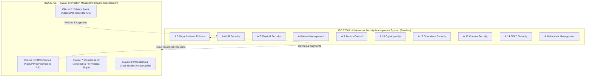

# Aegis GRC • ISO 27001 & 27701 Compliance Console

An enterprise-grade, high-fidelity **Governance, Risk, and Compliance (GRC)** and **Integrated Risk Management (IRM)** system of record console. Aegis GRC maps your compliance posture directly to **ISO/IEC 27001:2022 (Information Security)** and **ISO/IEC 27701:2019 (Privacy Information Management)**, mirroring workflows seen in industry-leading compliance platforms like **ServiceNow GRC, Vanta, and Drata**.

---

## 🌟 Modern GRC Framework Design

Unlike standard baseline dashboards, Aegis GRC is built on real-world IT audit schemas, structured compliance matrices, and continuous integration paradigms.

### 1. ServiceNow-style Control Objectives Ledger
*   **Structured Schema**: Every control is bound to a high-level **Control Objective** (the standard/requirement description), an assigned **Control Owner** (e.g. CISO, DPO, HR Director, IT Security Lead), a **Test Frequency** (Continuous Automated, Quarterly, Annually), and a designated **Evidence/Integration Source** (e.g. AWS Config, Okta, GitHub, Google Workspace).
*   **Auditor Detail Drawers**: Clicking any control objective smoothly expands a comprehensive audit drawer to edit owners, lifecycle states (Monitoring, Under Review, Draft, Retired), inherent risks, dates, and evidence notes.
*   **API Integrity Scan Simulator**: Force trigger standard automation tests to mock integration checks. Watch Vanta-style green `PASSED` / red `FAILED` / yellow `WARNING` status badges update dynamically.
*   **Remediation Assignment**: A simulation button to immediately dispatch remediation tickets to Jira and ping the respective Control Owner.

### 2. Inherent Risk vs. Residual Risk Calculus
Aegis GRC models standard GRC risk mitigation calculus in real-time. Residual Risk represents the threat impact remaining *after* a security control is successfully implemented:
*   **PASSED or EXEMPT Status**: The control is effective! Inherent Risk mitigates significantly (e.g. Critical becomes *Medium*, High/Medium becomes *Low*).
*   **WARNING Status**: The control is partially effective. Inherent Risk mitigates slightly.
*   **FAILED Status**: The control is completely broken. Residual Risk equals Inherent Risk (No mitigation).
*   **Dashboard Visuals**: Controls display their Inherent and Residual risk side-by-side (e.g. `Critical ➔ Medium`), which dynamically changes in real-time as you toggle compliance status dropdowns.

### 3. Interactive GRC Residual Risk Grid Matrix
*   **Heatmap Axis**: Maps controls by **Likelihood** (derived from the control's automated audit health: FAILED = High Likelihood, WARNING = Medium, PASSED/EXEMPT = Low) against **Impact** (derived from the inherent threat level).
*   **ServiceNow Dashboard Colors**: Displays distribution counts of risk exposure using exact enterprise color palettes (emerald green, warning amber, and crimson red).
*   **Active Isolation**: Click any cell in the heatmap matrix to instantly filter and isolate matching controls in the ledger (e.g. clicking the red **C1** cell isolates critical open vulnerabilities). A clear banner with a "Reset View" action button will restore the ledger.

### 4. Global "Collect Evidence" Automation Simulator
*   Click the **Collect Evidence** button in the header.
*   Watch a real-time system loading state collect telemetry from all active integrations (AWS, Okta, GitHub, Google Workspace).
*   Aegis GRC simulates "Continuous Compliance": resolving active warnings (e.g., clearing stale admin accounts from Okta directory, background check training completions) and updating your compliance percentage and risk rings automatically.

### 5. Priority 'Remediation Queue' Gaps
*   Scans both standards for failed controls, sorts them by highest Inherent Risk severity (`Critical` > `High` > `Medium` > `Low`), and displays the top 3 urgent remediations in the sidebar.
*   **Audit Portal Jump**: Click the review arrow on any queue item to automatically switch tabs, clear matrix filters, smooth-scroll, and visually flash the targeted control row with an auditor-recognition glow overlay.

### 6. CSV Audit Ledger Exporter
*   Downloads a formatted, Excel-ready, RFC 4180 compliant CSV ledger carrying column parameters: `Framework, Control ID, Control Name, GRC Objective, Control Owner, Test Frequency, Evidence Source, Assurance Status, Inherent Risk, Residual Risk, Auditor Notes, Last Reviewed Date`.

---

## 🛠️ How to Launch & Audit

1.  **Open the Console**: Navigate to **`D:\iso-compliance-dashboard\`** and double-click **`index.html`** to open it immediately in any modern web browser.
2.  **Toggle a Control**: Click on a row to expand its details. Change the status from `FAILED` to `PASSED`. Watch the Inherent-to-Residual tag shift, the **SVG Progress Circle** fill up, the **Residual Risk Matrix** recalculate, and the **Remediation Queue** clear.
3.  **Run automated tests**: Click the **Run Integrated Test** button inside an expanded row. Watch it simulate API calls, query logs, and return a success notification with an updated status.
4.  **Integrations Sync**: Click **Collect Evidence** in the top header to run a system-wide continuous sync.
5.  **Export Log**: Click **Export Audit Ledger** to download an Excel-compliant CSV of your entire governance boundary.

---

## 🛡️ ISO 27001 vs ISO 27701: The Compliance Relationship

Aegis GRC consolidates both frameworks into a single system of record, acknowledging their close conceptual and structural integration:

### 1. Direct Extension (Not a Replacement)
ISO 27701 is **not** a standalone certification. It is written as a PIMS (Privacy Information Management System) extension that overlays directly onto an established ISO 27001 ISMS (Information Security Management System). You cannot implement ISO 27701 without having first established or concurrently establishing an ISO 27001 framework.

### 2. Conceptual Mapping
Where ISO 27001 focuses on protecting the **Confidentiality, Integrity, and Availability (CIA)** of all corporate information assets, ISO 27701 shifts and focuses on protecting **Personal Identifiable Information (PII)** and ensuring the rights of **PII Principals** (data subjects) are upheld, meeting regional legislative rules like GDPR, CCPA, and CPRA.

### 3. Clause & Control Mapping
*   **Clause 5 & 6 (ISO 27701)** map directly onto Clauses 4-10 and Annex A of ISO 27001, amending them with privacy-specific requirements (e.g., establishing a PIMS Policy as part of A.5, assigning privacy roles as part of A.6).
*   **Clause 7 (ISO 27701)** covers privacy requirements specifically for **PII Controllers** (e.g., privacy notices, consent mechanisms, collection limits, DSAR requests, joint controller accountabilities).
*   **Clause 8 (ISO 27701)** covers privacy requirements specifically for **PII Processors** (e.g., customer agreements, processing limits, subcontracting data, notification of data breaches, records of cross-border transfers).
